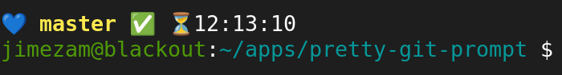
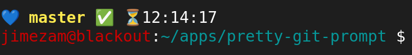

# pretty-git-prompt

Mejora a la configuración del prompt de Bash para mostrar información de Git.

## Imágenes

_Prompt_ en directorio sin Git


_Prompt_ en directorio con Git


_Prompt_ después de un error


## Instalación

Clonar el repositorio en la ubicación que se desee.

``` bash
$ cd ~/apps/

$ git clone https://github.com/jimezam/pretty-git-prompt.git
```

Configurar el inicio del _script_ al iniciar sesión.  Para hacer esto, editar el archivo `~/.bashrc`.

``` bash
$ vi ~/.bashrc
```

Agregar las siguientes instrucciones al final del archivo `~/.bashrc`, ajustando antes que la ruta indicada por la variable `$PRETTY_GIT_PROMPT` coin cida con el lugar donde se instaló el softare.

``` bash
PRETTY_GIT_PROMPT=~/apps/pretty-git-prompt/pretty-git-prompt.sh

if [ -f "$PRETTY_GIT_PROMPT" ]; then
  . "$PRETTY_GIT_PROMPT"
else
  echo "ERROR: pretty-git-prompt is missing"
fi
```

Una vez hecho este cambio, aplicará para los _shells_ que abra posteriormente, para que aplique al _shell_ actual puede ejecutar el siugiente comando.

``` bash
$ source ~/.bashrc
```

## Nomenclatura de íconos

| Icon | Description |
|---|---|
| 💙 | Current directory is a Git repository |
| 😎 | Current directory is a normal directory |
| ✅ | All is clear |
| 🆕 | Untracked files |
| ⚡ | Modified files (not staged) |
| 🔄 | Staged files |
| 💾 | Stashed changes |
| ⏳ | Rebase in progress |
| 🚧 | Merge in progress |
| 🔁 | Revert in progress |
| 🍒 | Cherry-pick in progress |
| 🚫 | Detached HEAD state |
| 💥 | Stash exists but working tree is clean |
| ↕️ | Local branch ahead and behind of remote |
| ⬆️ | Local branch head of remote |
| ⬇️ | Local branch behind remote |

## Solución de errores

Si hay problemas con el uso del _script_, verificar que la siguiente información sea correcta.

La variable `$PRETTY_GIT_PROMPT` en `~/.bashrc` tenga la ruta correcta donde se ubica el archivo `pretty-git-prompt.sh`.

La variable `$GIT_SH_PROMPT` en `pretty-git-prompt.sh` tenga la ruta correcta donde se ubica el archivo `git-sh-prompt` (por defecto `usr/lib/git-core/git-sh-prompt`).  Este archivo debe venir con su distribución de Git.
